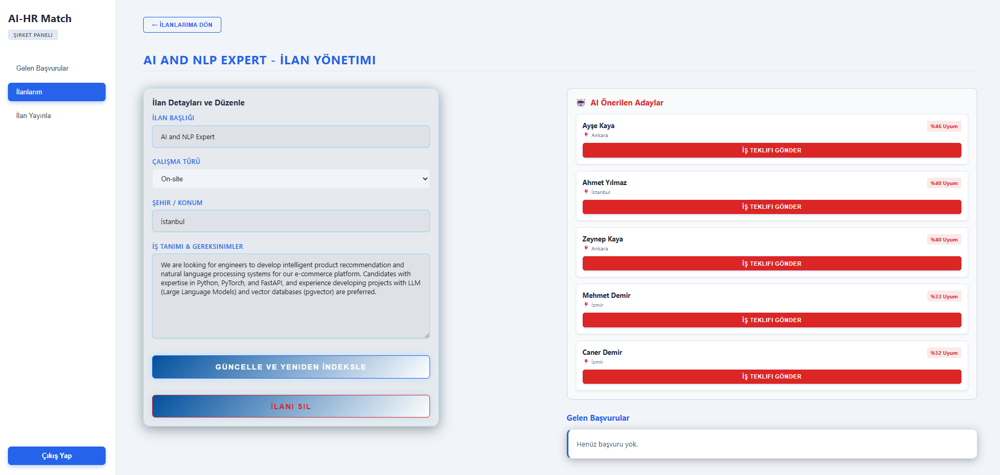
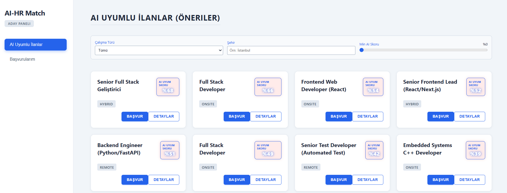
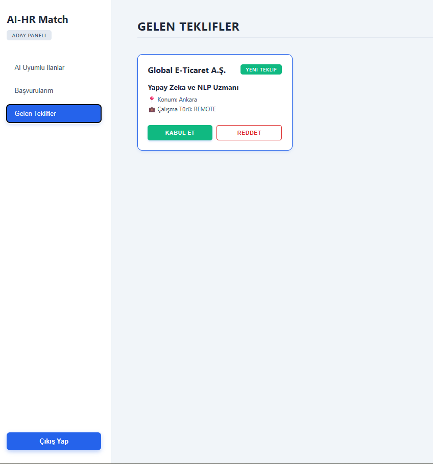
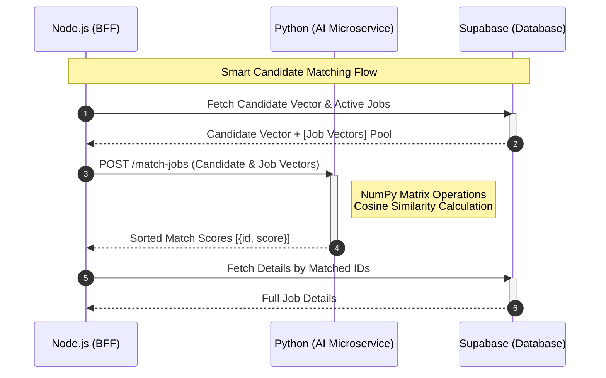

# AI-Powered Smart HR Matching Platform (AI-HR Match)

AI-powered HR platform built with React, Node.js, FastAPI, and Supabase that performs semantic candidate-job matching using LLMs and vector embeddings.


The **Smart HR Matching Platform** is an AI-powered web application designed to streamline the recruitment process. By leveraging vector semantic search and Large Language Models (LLMs), it connects companies and candidates based on skill alignment rather than relying solely on traditional application workflows.

Developed as a **Full-Stack AI-Powered MVP**, this platform incorporates modern software architecture standards, microservices communication, and artificial intelligence.

---

## 📸 Platform Screenshots

|                        AI Job Management & Autonomous Offers                         |                         Candidate Dashboard (AI Match Scores)                          |                          Candidate View: Incoming Offers                           |
| :----------------------------------------------------------------------------------: | :------------------------------------------------------------------------------------: | :--------------------------------------------------------------------------------: |
|  |  |  |

_(Note: The platform features a responsive Light Corporate UI with Blue and Maroon highlights.)_

---

## ✨ Key Features

- **Proactive AI Offer System:** As soon as a job is posted, the AI analyzes the requirements and semantically compares them with candidate vectors, allowing companies to send direct job offers to highly matched candidates.
- **Dynamic Re-Vectorization:** Updating a job posting or a candidate's resume automatically triggers the AI microservice to recalculate the 384-dimensional vector, keeping the matching engine accurate.
- **Real-time AI Match Scoring:** Compatibility scores are calculated dynamically using Cosine Similarity between the latest vectors via the Python engine.
- **Hybrid Pre-Filtering (SQL + AI):** Users can filter data by attributes (e.g., city, work type) at the database layer (SQL) before the AI applies heavy semantic scoring, ensuring high performance.
- **Role-Based Dynamic Onboarding:** Forced profile completion flows customized for Company and Candidate roles to ensure data integrity for the AI engine.

---

## 🛠 Technology Stack

| Category            | Technology                               | Purpose                                                          |
| :------------------ | :--------------------------------------- | :--------------------------------------------------------------- |
| **Frontend**        | React.js (Vite), Vanilla CSS             | Client-side application, state management, and UI routing.       |
| **Backend (BFF)**   | Node.js, Express.js                      | API Gateway, data orchestration, and JWT validation.             |
| **AI Microservice** | Python, FastAPI                          | Independent service handling all ML/AI computations.             |
| **LLM & Vectors**   | Ollama (Llama 3.2), SentenceTransformers | Skill extraction (JSON) and semantic embedding generation.       |
| **Math Engine**     | NumPy                                    | High-performance Cosine Similarity matrix calculations.          |
| **Database & Auth** | Supabase (PostgreSQL)                    | Data persistence, Vector storage, and secure JWT Authentication. |

---

## 🧩 Architecture Overview

The system is designed with a Monorepo approach utilizing a BFF (Backend-For-Frontend) pattern. To ensure optimal performance and secure data isolation, the platform uses **application-layer data aggregation** (merging data within the Node.js backend) rather than relying on complex database-level joins.

## 📂 Repository Structure

| Directory       | Description                                     |
| --------------- | ----------------------------------------------- |
| `frontend/`     | React (Vite) client application                 |
| `backend-main/` | Express.js Backend-for-Frontend (BFF)           |
| `ai-service/`   | Python FastAPI AI microservice                  |
| `docs/`         | Architecture diagrams and project documentation |
| `README.md`     | Project documentation and setup guide           |

### AI Matching Sequence



## 🚀 Future Improvements

- Email / SMS notifications
- Real-time chat with Socket.io
- AI Interview Assistant
- Calendar integration
- Docker & Docker Compose
- CI/CD pipeline
- Unit & Integration tests

## ⚙️ Local Installation & Setup

### 1. Prerequisites

Node.js (v18+) and npm

Python (v3.10+)

Ollama: Install Ollama and run ollama run llama3.2 to download the local LLM.

Supabase: An active Supabase project.

### 2. Environment Variables

Create a .env file inside the backend-main/ folder:

```env
SUPABASE_URL=...
SUPABASE_SERVICE_ROLE_KEY=...
```

### 3. Service Initialization

Open three separate terminals and run the following commands concurrently:

#### Terminal 1: AI Service (Python)

```bash
cd ai-service
python -m venv venv
source venv/bin/activate # On Windows use: venv\Scripts\activate
pip install -r requirements.txt
python -m uvicorn main:app --reload
(Runs on http://localhost:8000)
```

#### Terminal 2: Backend (Node.js)

```Bash
cd backend-main
npm install
npm run dev
(Runs on http://localhost:5000)
```

#### Terminal 3: Frontend (React)

```Bash
cd frontend
npm install
npm run dev
(Runs on http://localhost:5173)
```
